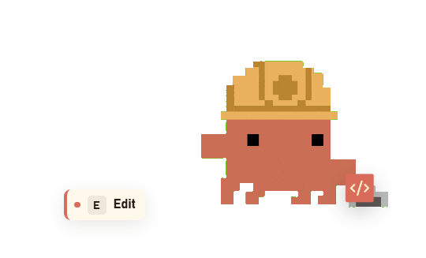
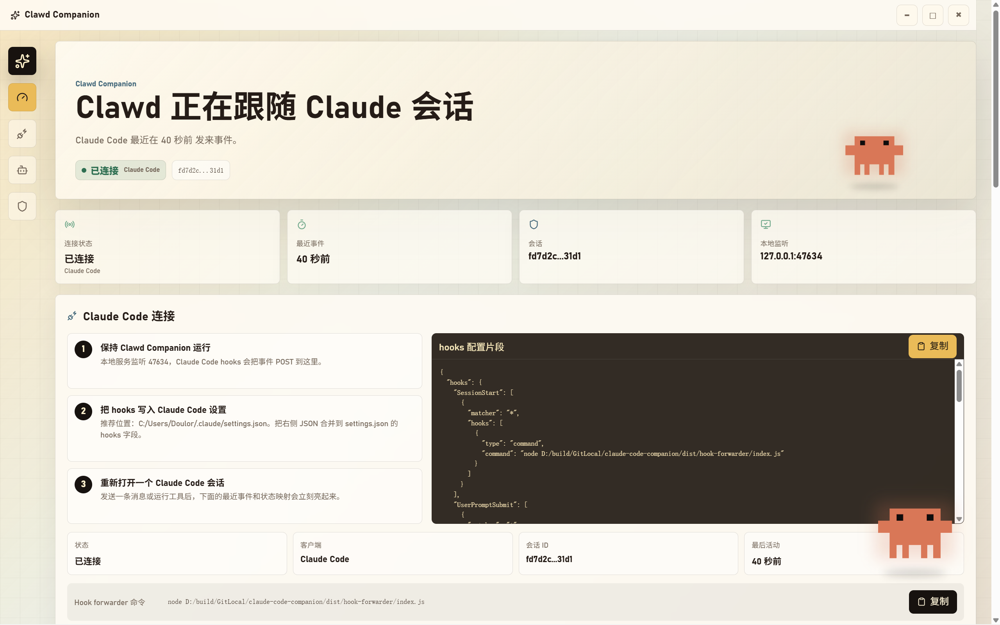
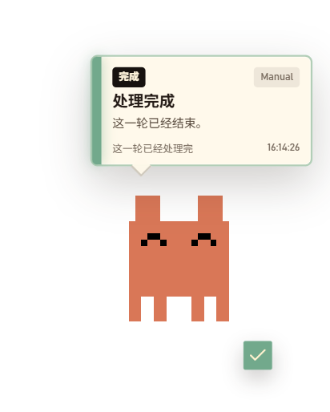
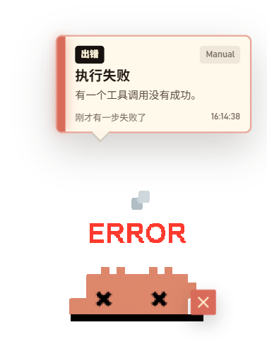

# Clawd Companion

Claude Code 桌宠伴侣 — 透明桌宠窗口实时显示 Claude Code 的工具调用、会话状态和完成提醒。

基于 Claude Code 吉祥物 Clawd 的像素精灵动画，支持思维气泡、通知卡片和工具条三种反馈样式。

<div align="center">
  
  &nbsp;
  
</div>

## 功能

<div align="center">
  
</div>

- 透明桌宠窗口，始终置顶，支持拖动和边界限制
- 本地 HTTP 事件服务接收 Claude Code hooks 事件
- Hook forwarder 自动转发 SessionStart / UserPromptSubmit / PreToolUse / PostToolUse / Notification / Stop
- **自动更新**：基于 GitHub Releases，启动时静默检查，一键安装新版本
- **待机随机动画**：待机时每隔 15~120 秒随机播放 idle_bubble / permission_prompt 等精灵动画，可自定义动画池、间隔和播放次数
- **动作动画映射**：支持为每个工具/事件自定义 clawd 精灵动画
- 配置面板：连接状态、桌宠外观、隐私模式、事件映射、反馈样式自定义
- 思维气泡、通知卡片和工具条三种反馈模式，可按状态和工具独立配置
- 分别调整 Clawd 和各元素的大小与透明度
- 单实例锁、托盘菜单、开机自启
- **运行统计**：持久化存储工具调用排行、会话数、权限统计、活跃时段等深度数据
- **设置导入/导出**：一键导出或导入 JSON 配置文件

### 完成与错误提醒

<div align="center">
  
  &nbsp;
  
</div>

## 安装

从 [Releases](https://github.com/Doulor/Clawd-Companion/releases) 下载最新版安装包，双击运行即可。

安装完成后启动 Clawd Companion，打开配置面板，点击「一键安装」配置 Claude Code hooks，然后重新打开 Claude Code 会话即可自动连接。

## 开发

```bash
# 安装依赖
npm install

# 开发模式（Electron + Vite 热更新）
npm run dev:electron

# 构建
npm run build

# 打包为安装程序
npm run dist

# 校验 latest.yml 文件名一致性
npm run dist:validate
```

## 技术栈

- Electron + React + TypeScript + Vite
- electron-updater 自动更新（GitHub Releases）
- 本地 HTTP + WebSocket 事件服务
- Claude Code hooks 转发器（Node.js CLI）
- electron-builder NSIS 安装包

## License

MIT
